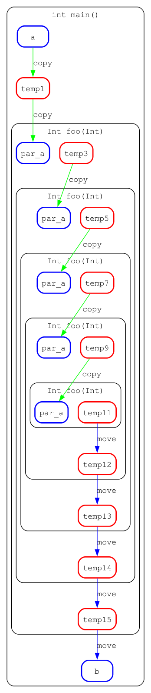

# Microscope

## Introduction

This is a simple application for detecting life path of variable.



## Build

```
git clone https://github.com/kefirRzevo/Dedinsky-CPP-course.git
cd Microscope
make
make clean
```
