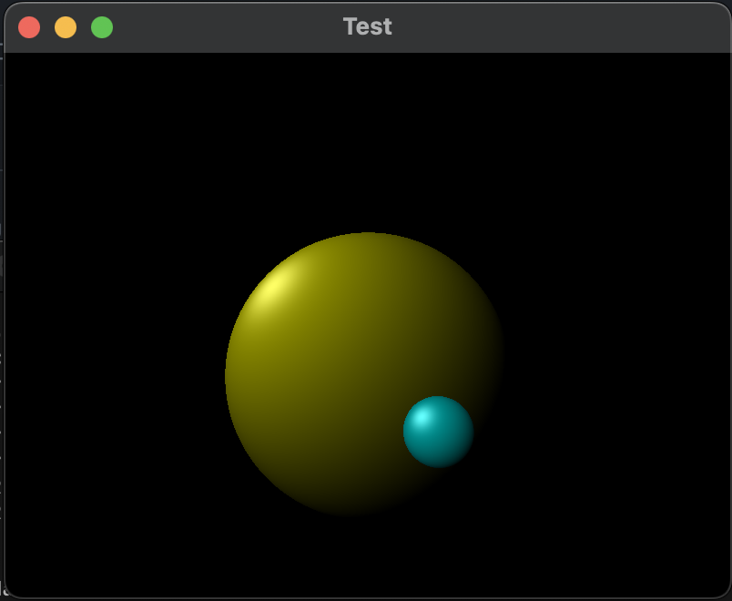

# Ray Casting

## Introduction

This is simple Ray Caster that uses SFML library for visualization.



## Build

Before cloning, make sure SFML is installed.

```
git clone https://github.com/kefirRzevo/Dedinsky-CPP-course.git
cd RayCasting
make
make clean
```
