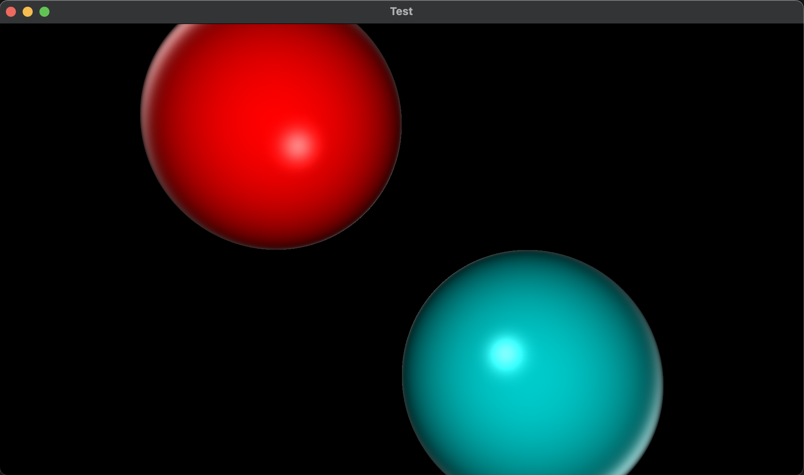

# Ray Traycer

## Introduction

This is simple Ray Traycer that uses SFML library for visualization.



## Build

Before cloning, make sure SFML is installed.

```
git clone https://github.com/kefirRzevo/Dedinsky-CPP-course.git
cd RayTraycing
make
make clean
```
